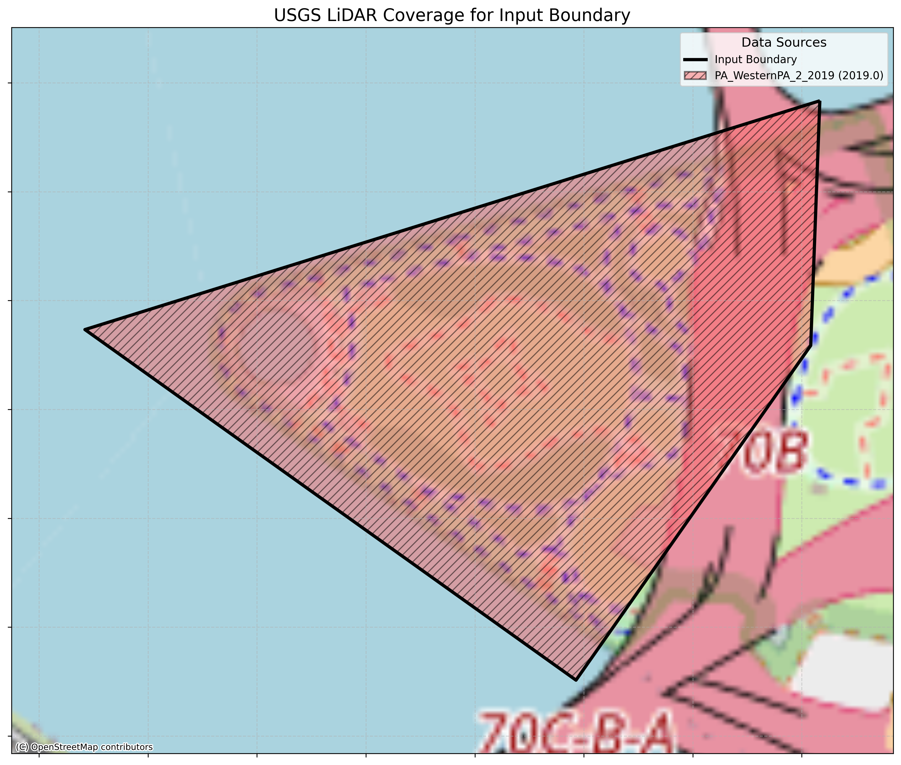

# USGS LiDAR CLI Tool

A command-line interface tool for downloading USGS LiDAR data based on GeoJSON boundaries.

## Features

- Download LiDAR data from USGS 3DEP datasets using GeoJSON boundary files
- Automatically identify intersecting USGS LiDAR datasets
- Create visualizations with basemaps showing data coverage and overlaps
- Support for prioritizing the most recent datasets
- Dry-run mode to check for available data without downloading
- Efficient handling of data from multiple sources

## Coverage
- Coverage is based on the USGS public lidar boundaries at: https://raw.githubusercontent.com/hobu/usgs-lidar/master/boundaries/resources.geojson
- Some areas have no coverage. See `usgs_lidar_boundaries.gpkg`

## Installation

### Prerequisites

- Python 3.7 or higher
- PDAL (Point Data Abstraction Library) installed and available in PATH

### Install from source

The easiest way to install is to use the provided installation script:

```bash
# Clone the repository
git clone https://github.com/DHersh3094/USGS-LiDAR-CLI-Tool.git
cd USGS-LiDAR-CLI-Tool

# Run the installation script
bash install_and_test.sh
```

This script will:
1. Create a virtual environment
2. Install the package and its dependencies
3. Create global command links for easier access
4. Run basic tests to verify the installation

Alternatively, you can install manually:

```bash
# Clone the repository
git clone https://github.com/DHersh3094/USGS-LiDAR-CLI-Tool.git
cd USGS-LiDAR-CLI-Tool

# Create and activate a virtual environment
python -m venv venv
source venv/bin/activate

# Install the package
pip install -e .

# Create command links (optional)
mkdir -p ~/.local/bin
ln -sf "$(pwd)/venv/bin/USGS-LiDAR-CLI-Tool" ~/.local/bin/USGS-LiDAR-CLI-Tool
ln -sf "$(pwd)/venv/bin/USGS_LiDAR_CLI_Tool" ~/.local/bin/USGS_LiDAR_CLI_Tool
```

After installation, you may need to run `source ~/.bashrc` to update your current shell, or open a new terminal window.

## Usage

### Basic Usage

```bash
USGS-LiDAR-CLI-Tool --geojson your_boundary.geojson --output-dir output_directory
```

### Command Line Options

- `--geojson`, `-g`: Path to input GeoJSON file defining the boundary (required)
- `--output-dir`, `-o`: Output directory for downloaded LAZ files (default: lidar_data)
- `--config`, `-c`: Path to configuration file (default: config.json)
- `--resolution`, `-r`: Resolution to use for the data in Entwine Point Tile (EPT) format. Use 'full' for native resolution (all points), or specify a numeric value in coordinate units (meters) to control point spacing. For example, '1.0' will retrieve points with ~1m spacing, '0.5' creates denser point clouds, and '2.0' creates sparser data. Lower values = more detail and larger files.
- `--classify_ground`: Add smrf ground classification (default: true)
- `--workers`, `-w`: Number of parallel workers (default: from config or 8)
- `--verbose`, `-v`: Enable verbose logging
- `--dry-run`, `-d`: Find intersecting datasets but don't download files
- `--keep-temp`, `-k`: Keep temporary downloaded files from each dataset
- `--most-recent`: Use only the most recent data when multiple datasets overlap
- `--no-visualization`: Skip creating visualization of datasets and boundary

### Examples

Check available datasets without downloading:
```bash
USGS-LiDAR-CLI-Tool --geojson demo.geojson --dry-run
```

Creates an image:



Then download all intersecting pointclouds (in this case only 1):
```bash
USGS-LiDAR-CLI-Tool --geojson demo.geojson
```

Logs are saved to `demo_info.txt`
```
USGS LiDAR Downloader Report
Generated on: 2025-05-16 20:15:09
Input GeoJSON: demo.geojson

Intersecting Datasets (1):
  1. FL_Peninsular_FDEM_Nassau_2018 (2018.0)

Download Strategy: All intersecting datasets

Download Log:
  - Successfully downloaded 1 files from FL_Peninsular_FDEM_Nassau_2018
    Output file: demo_FL_Peninsular_FDEM_Nassau_2018.laz

Each dataset was downloaded to a separate file.
No merging was performed because --most-recent flag was not used.
```

Download using only the most recent datasets (If there are more than 1 intersecting):
```bash
USGS-LiDAR-CLI-Tool --geojson area.geojson --most-recent
```

Download at a specific resolution:
```bash
USGS-LiDAR-CLI-Tool --geojson area.geojson --resolution 1.0
```

Enable verbose logging for debugging:
```bash
USGS-LiDAR-CLI-Tool --geojson area.geojson --verbose
```

## Output

The tool creates an organized directory structure:
- Each GeoJSON input gets its own subfolder
- Visualizations show dataset coverage
- Detailed info.txt file with dataset information
- LAZ files are named after the input GeoJSON

## Known Issues and Bugs

### Date Parsing Issues

- **Dataset Year Parsing**: Some USGS dataset bucket names have non-standard formatting that prevents correct date/year extraction. For example, buckets like "AR_NorthEast_1_D22" will not have their dates parsed correctly, which can impact the `--most-recent` functionality and visualization year labels.

## To do:
- Add CRS option during download
- Add bulk download support using an input GeoPackage

## License

GPL 3-Clause. See [LICENSE](LICENSE) file for details.
